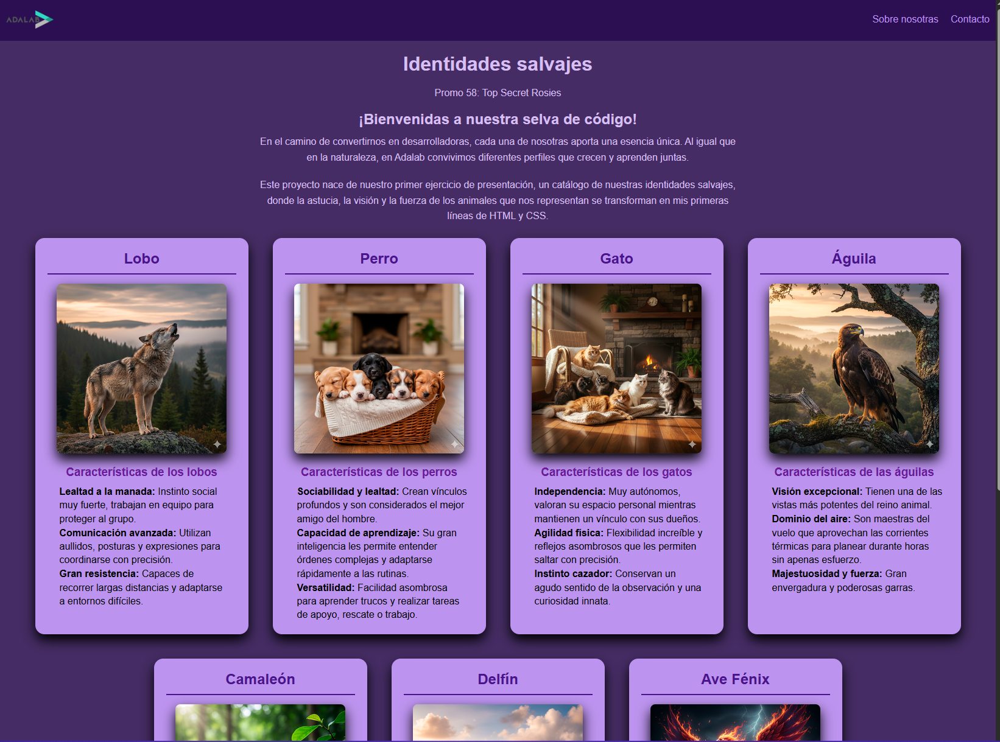

# 🐾 Proyecto: Identidades Salvajes

¡Hola! 👋 Este es **mi primer proyecto web**, desarrollado mientras doy mis primeros pasos en el mundo del desarrollo Front-end.

> [!NOTE].
> **Puedes ver el proyecto en vivo aquí:** https://colet-cristina.github.io/mi-primer-proyecto-web/index.html

## 🎯 Objetivo

El reto era crear una página web utilizando únicamente **HTML5 y CSS3**, enfocándome en aprender la estructura de las etiquetas y el diseño.

## 💡 Aprendizajes

En este proyecto he logrado:

- **Entender el flujo de HTML:** Cómo organizar la información de forma semántica.
- **Flexbox:** Para alinear las tarjetas de animales y centrar el contenido de la página de contacto.
- **Cascada de CSS:** Aprender cómo los estilos se heredan y cómo organizar mi archivo `main.css`.
- **Navegación:** Conectar diferentes archivos `.html` mediante rutas relativas.

## 🛠️ Herramientas

- Visual Studio Code
- HTML5 / CSS3
- Mucho café ☕ y paciencia con los bugs.

---

_Este es el inicio de mi camino como desarrolladora. ¡Gracias por visitar mi proyecto!_
